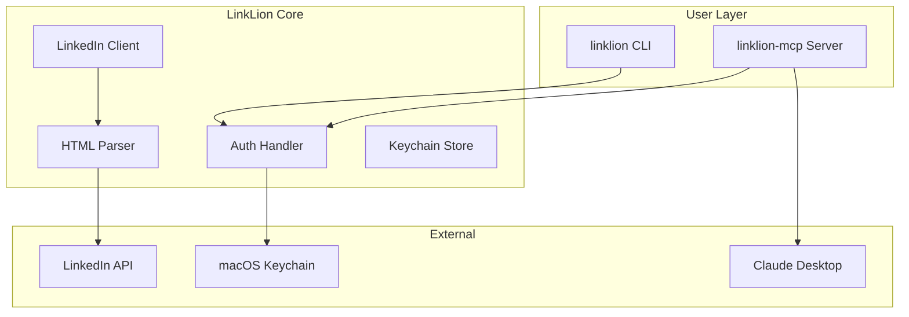

# 🦁 LinkLion

> **LinkedIn scraping CLI + MCP server in Swift** — Roar through LinkedIn data with lion-sized power!

[](https://swift.org)
[](https://developer.apple.com/macos)
[](https://modelcontextprotocol.io)
[](LICENSE)

```
╔═══════════════════════════════════════════════════════════════════╗
║  🔥 LinkLion 🔥  LinkedIn Scraping CLI + MCP Server  🦁 Lion Power ║
╚═══════════════════════════════════════════════════════════════════╝
```

## ✨ Features

- **🦁 Profile Scraping** — Get detailed person profiles with experience, education, & skills
- **🏢 Company Intelligence** — Extract company info, industry, & specialties
- **💼 Job Search Engine** — Search jobs with location filtering & detailed specs
- **🔐 Secure Auth** — Cookie-based auth stored safely in macOS Keychain
- **🤖 MCP Server** — Claude Desktop integration for AI-powered LinkedIn research
- **📦 Swift Native** — Built 100% in Swift 6 with modern async/await

## 🚀 Quick Start

### Installation

```bash
# Clone the repo
git clone https://github.com/RyanLisse/LinkLion.git
cd LinkLion

# Build release
swift build -c release

# Install CLI tools
cp .build/release/linklion /usr/local/bin/
cp .build/release/linklion-mcp /usr/local/bin/
```

### Authentication

LinkLion uses LinkedIn's `li_at` cookie for authentication:

```bash
# Interactive auth (shows instructions)
linklion auth

# Direct auth
linklion auth YOUR_LI_AT_COOKIE_HERE

# Check status
linklion status
```

## 📖 Usage

### CLI Commands

```bash
# 👤 Get a profile
linklion profile johndoe
linklion profile "https://linkedin.com/in/johndoe" --json

# 🏢 Get a company
linklion company microsoft
linklion company "https://linkedin.com/company/anthropic" --json

# 💼 Search jobs
linklion jobs "Swift Developer" --location "Remote" --limit 10

# 📋 Get job details
linklion job 1234567890 --json
```

### MCP Server Setup

Add to your `~/Library/Application Support/Claude/claude_desktop_config.json`:

```json
{
  "mcpServers": {
    "linklion": {
      "command": "/usr/local/bin/linklion-mcp",
      "args": [],
      "disabled": false
    }
  }
}
```

## 🏗️ Architecture



## 🛠️ Library Usage

```swift
import LinkLion

// Create client
let client = await createClient()

// Configure with cookie
await client.configure(cookie: "your-li_at-cookie")

// Get profile
let profile = try await client.getProfile(username: "satya-nadella")
print("Name: \(profile.name)")
print("Title: \(profile.headline ?? "N/A")")

// Search jobs
let jobs = try await client.searchJobs(query: "iOS Developer", location: "SF")
for job in jobs {
    print("  \(job.title) @ \(job.company)")
}
```

## 📚 Documentation

- [📖 Architecture](docs/ARCHITECTURE.md) — System design & data flow
- [🔌 API Reference](docs/API.md) — Complete library API docs
- [🤖 MCP Integration](docs/MCP.md) — MCP server tools & examples

## 🔧 Development

```bash
# Build
swift build

# Run tests
swift test

# Release build
swift build -c release
```

## ⚠️ Limitations

- Rate limiting may occur with frequent requests
- Cookie expires ~1 year (refresh when auth fails)
- LinkedIn may update HTML structure (parsers may need updates)
- CAPTCHA challenges may block requests

## 📄 License

MIT License — See [LICENSE](LICENSE) for details.

## 🙏 Credits

Inspired by [linkedin-mcp-server](https://github.com/stickerdaniel/linkedin-mcp-server) (Python).

---

**Built with 🦁 Lion Power by RyanLisse**
